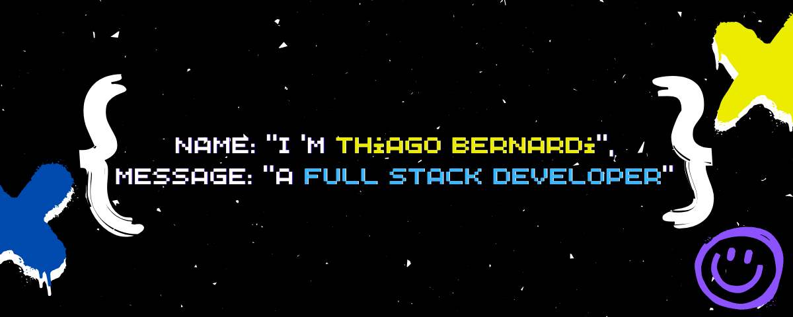

    

 
 <!--  -->
 
 

<h2 align="center">Technology Stack </h2>

 

  
  

<h2 align="center">Reach me out on </h2>

<h2 align="center">
  My Contribution Graph 
</h2>

  

<h2 align="center">
  My Github Stats
</h2>

 

  <a href="https://github.com/copocaneta">
    
    
    
     
    
  </a>

<!--
**copocaneta/copocaneta** is a ✨ _special_ ✨ repository because its `README.md` (this file) appears on your GitHub profile.

Here are some ideas to get you started:

- 🔭 I’m currently working on ...
- 🌱 I’m currently learning ...
- 👯 I’m looking to collaborate on ...
- 🤔 I’m looking for help with ...
- 💬 Ask me about ...
- 📫 How to reach me: ...
- 😄 Pronouns: ...
- ⚡ Fun fact: ...
-->
